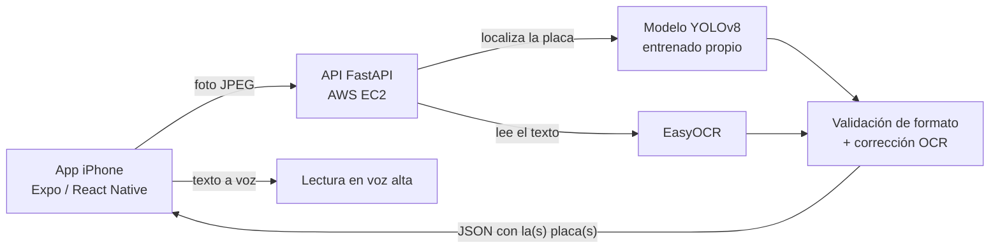

# 🚗 Reconocimiento de Placas Vehiculares

Sistema completo de reconocimiento automático de placas vehiculares colombianas en tiempo real: modelo de detección propio (YOLOv8), lectura de caracteres con EasyOCR, backend en AWS y una app móvil nativa para iPhone con escaneo continuo y lectura en voz alta.

Proyecto desarrollado para la materia **Ciencia de Datos**.

**Estudiante:** Miguel Angel Solano Diaz
**Repositorio:** https://github.com/Codemikey21/reconocimiento-placas

---

## ✨ Características

- **Escaneo continuo**: la app analiza el video de la cámara automáticamente, sin necesidad de tomar la foto manualmente.
- **Lectura en voz alta**: cada placa detectada se anuncia por voz (texto a voz) apenas se reconoce.
- **Modelo propio**: la localización de la placa la hace un modelo YOLOv8 entrenado por mí mismo (transfer learning sobre un dataset de Roboflow Universe), no un servicio de terceros.
- **Detección de varias placas a la vez**: si hay más de un vehículo en el cuadro, el sistema detecta y lee todas las placas visibles en una sola foto.
- **Validación de formato colombiano**: el texto leído se valida y corrige contra los formatos reales de placa (autos: 3 letras + 3 números; motos: 3 letras + 2 números + 1 letra).
- **Backend en la nube**: la API corre 24/7 en una instancia de AWS EC2, como servicio de sistema (`systemd`), no en un servidor local.
- **Diseño cuidado**: interfaz clara y minimalista, con animaciones (escaneo, resultados, historial) e íconos consistentes.

---

## 🏗️ Arquitectura



El flujo completo, en palabras: la app toma una foto cada ~1 segundo mientras el escaneo está activo, se la envía al backend; el backend usa el modelo YOLO propio para encontrar dónde está cada placa en la imagen, le pasa cada recorte a EasyOCR para leer los caracteres, valida el resultado contra el formato de placa colombiano (corrigiendo confusiones típicas del OCR, como `O` por `0`), y devuelve el texto de todas las placas encontradas. La app anuncia por voz las que sean nuevas y las guarda en el historial.

---

## 🧰 Tecnologías

| Componente | Tecnología |
| --- | --- |
| App móvil | Expo (React Native), `expo-camera`, `expo-speech`, `expo-file-system` |
| Backend | FastAPI (Python), Uvicorn |
| Detección de placa | YOLOv8n (Ultralytics), entrenado con dataset de [Roboflow Universe](https://universe.roboflow.com/) |
| Lectura de caracteres | EasyOCR |
| Infraestructura | AWS EC2 (Ubuntu), `systemd`, IP/DNS elástico |
| Entrenamiento | Google Colab (GPU) |

---

## 📁 Estructura del repositorio
placas-reconocimiento/
├── mobile/                    App Expo (React Native) para iPhone
│   ├── App.js
│   ├── config.js              URL del backend
│   └── app.json
├── backend/                   API FastAPI
│   ├── app/
│   │   ├── main.py
│   │   ├── plate_pipeline.py
│   │   └── models/best.pt     pesos del modelo YOLO entrenado
│   ├── requirements.txt
│   └── README.md              guía de despliegue en AWS EC2
├── ml/                        Entrenamiento del modelo YOLO
│   └── README.md              guía paso a paso (Colab + Roboflow)
└── aws/
    └── README.md              guía de infraestructura AWS (EC2, Security Group, IP elástica)

---

## 🚀 Cómo probarlo

### 1. Backend (API)

Para correrlo en producción en AWS, sigue `backend/README.md` y `aws/README.md`. Para correrlo localmente en tu PC mientras desarrollas:

```powershell
cd backend
python -m venv venv
.\venv\Scripts\Activate.ps1
pip install -r requirements.txt
uvicorn app.main:app --host 0.0.0.0 --port 8000 --reload
```

Prueba que responde:

```powershell
curl http://localhost:8000/health
```

### 2. App móvil

```powershell
cd mobile
npm install
npx expo start
```

Escanea el código QR con la app **Expo Go** en tu iPhone (celular y PC en la misma red WiFi). Antes, ajusta `mobile/config.js` con la URL de tu backend (local o el de AWS).

### 3. Entrenar tu propio modelo (opcional, ya está entrenado)

El modelo `best.pt` ya viene entrenado y listo en `backend/app/models/best.pt`. Si quieres reentrenarlo o mejorarlo, la guía completa está en `ml/README.md` (entrenamiento con YOLOv8 en Google Colab sobre un dataset de placas de Roboflow Universe).

---

## 📊 Resultados del modelo

- **mAP@50:** 0.995 sobre el set de validación.
- **Tiempo de respuesta típico:** 280 – 1300 ms por foto (usando el modelo propio para localizar la placa; en CPU, sin GPU en el servidor).
- **Soporta múltiples placas por foto**, cada una con su propio nivel de confianza.

---

## 👤 Autor

**Miguel Angel Solano Diaz** — Ingeniería de Software, UNAB
Proyecto realizado para la materia de Ciencia de Datos.
